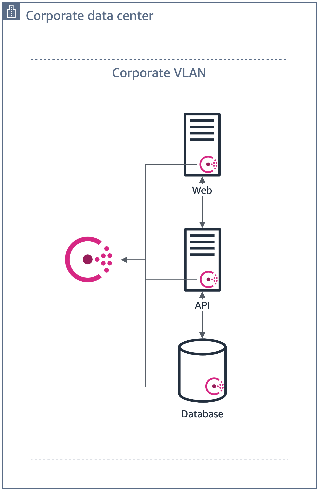
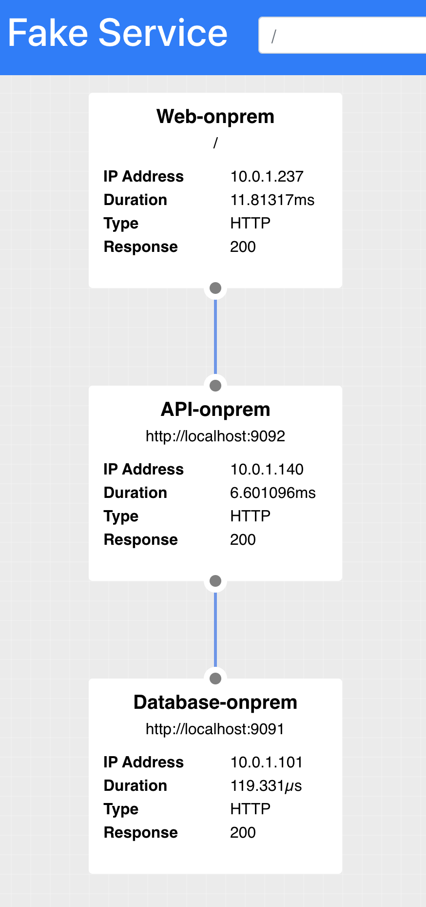
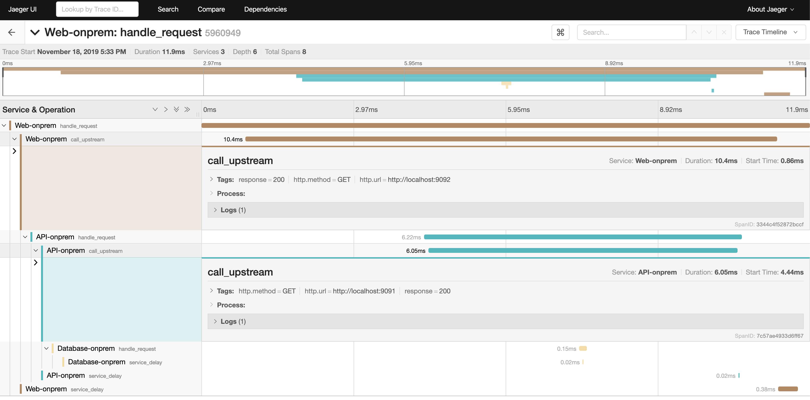

# Adding Service Mesh to On-Prem

We have an 3-tier service with web, application, and database tiers. To make it easier to control the services,
we've added Consul service mesh within the datacenter.



When we access the Web UI at `open http://$(terraform output web_onprem):9090/ui`, we will see the web UI
connecting to the API on `http://localhost:9092` and the database at `http://localhost:9091`.



This is because each service as there is a Consul proxy running on each server. As long as the outbound request matches the address and port we bound to the upstream service, we can simply use the address and port on `localhost`. We do not have to program the static IP or load-balanced endpoint for each tier.

```json
{
  "service": {
    "name": "web",
    "id":"web",
    "port": 9090,
    "checks": [
      {
       "id": "web",
       "name": "Web on port 9090",
       "http": "http://localhost:9090/health",
       "tls_skip_verify": false,
       "method": "GET",
       "interval": "10s",
       "timeout": "1s"
      }
    ],
    "connect": { 
      "sidecar_service": {
        "port": 20000,
        "proxy": {
          "upstreams": [
            {
              "destination_name": "api",
              "local_bind_address": "127.0.0.1",
              "local_bind_port": 9092
            }
          ]
        }
      }
    }  
  }
}
```

We built the Web UI to show the request chain. If we do not have the Web UI, we direct
onprem tracing to Jaeger to visualize the requests from the application.
Note that the `call_upstream` metadata shows the Consul proxy endpoints.

