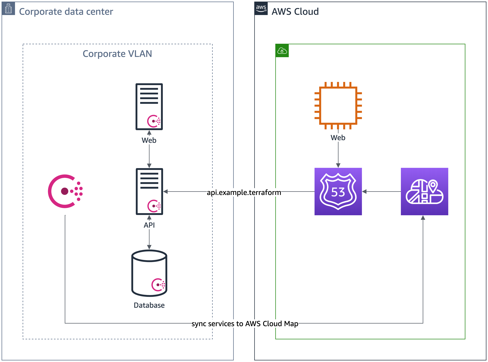
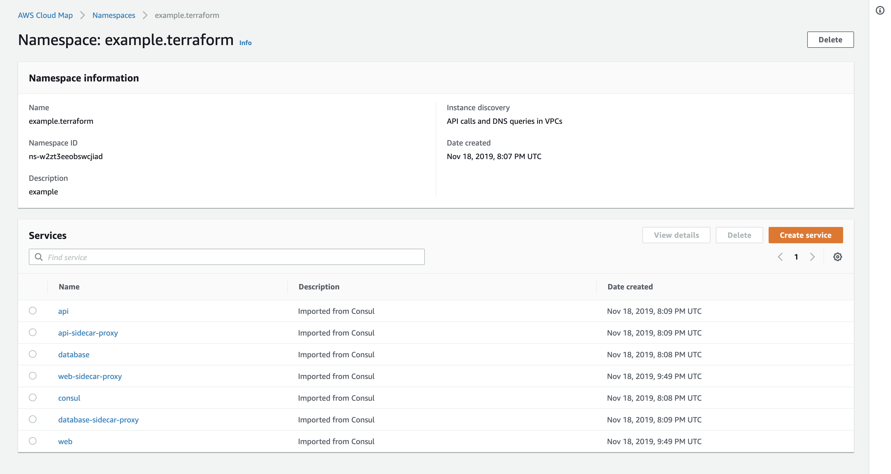
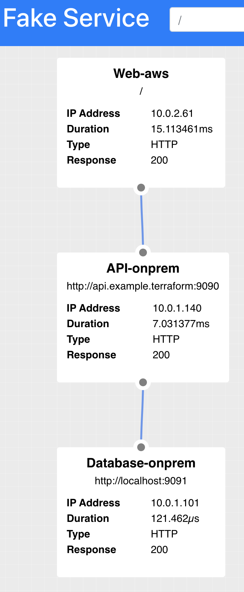
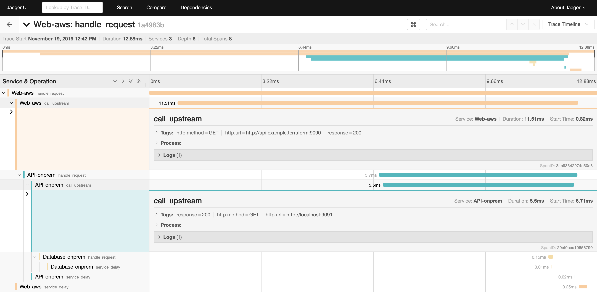

# Refactor Web Tier onto AWS

Imagine we refactored the web tier and host it on an AWS EC2 instance.



We did not refactor the API tier yet but we need to determine if our web tier hosted on AWS
works. We can use AWS Cloud Map to resolve to the services that are running in the Consul
Service Mesh.

## Configure Permissions for AWS Cloud Map

In order for our Consul server to access [AWS Cloud Map](https://aws.amazon.com/cloud-map/), we attach an IAM role to the Consul
server. The IAM role must have the following policy:

```json
{
   "Version": "2012-10-17",
   "Statement": [
      {
         "Sid" : "AllowInstancePermissions",
         "Effect": "Allow",
         "Action": [
            "servicediscovery:RegisterInstance",
            "servicediscovery:DeregisterInstance",
            "servicediscovery:DiscoverInstances",
            "servicediscovery:CreateService",
            "servicediscovery:Get*",
            "servicediscovery:List*",
            "route53:GetHostedZone",
            "route53:ListHostedZonesByName",
            "route53:ChangeResourceRecordSets",
            "route53:CreateHealthCheck",
            "route53:GetHealthCheck",
            "route53:DeleteHealthCheck",
            "route53:UpdateHealthCheck"
         ],
         "Resource": "*"
      }
   ]
}
```

The EC2 instance has access to create namespaces and add services.

## Install consul-aws

On our Consul server, we install [consul-aws](https://github.com/hashicorp/consul-aws). As a binary,
it synchronizes services registered in Consul to AWS Cloud Map. We start consul-aws with
the `sync-catalog` command.

```shell
consul-aws sync-catalog -aws-namespace-id ${namespace_id} -to-aws -to-consul
```

We must pass the namespace identifier generated by AWS Cloud Map. This identifier denotes the DNS
namespace AWS Cloud Map uses to register the services. We can use the following Terraform configuration
below to create the AWS Cloud Map namespace.

```hcl
resource "aws_service_discovery_private_dns_namespace" "example" {
  name        = "example.terraform"
  description = "example"
  vpc         = aws_vpc.default.id
}
```

## Check Consul Services with AWS Cloud Map

We should see AWS Cloud Map register the onprem Web, API, and Database services.



This means we can resolve from our Web UI in AWS to `api.example.terraform`.

## Configure Web UI on AWS

We configure the Web UI to access the `api.example.terraform` instead
of the `localhost:9092` onprem API endpoint. Our Web UI has a variable
called `UPSTREAM_URI` to access the API endpoint.

```shell
UPSTREAM_URIS=http://api.example.terraform:9090
```

We use the AWS Cloud Map entry for the API endpoint onprem. When we access the Web UI hosted on AWS,
we should see the API endpoint direct to `api.example.terraform`.



We built the Web UI to show the request chain. If we do not have the Web UI, we direct
onprem tracing to Jaeger to visualize the requests from the application.
Note that the `call_upstream` metadata shows the `api.example.terraform` endpoint.



We confirm that our functionality still works in this canary test.
Let's add a Consul sidecar to the Web UI on AWS EC2 so we can better manage
the migration from hybrid to AWS.