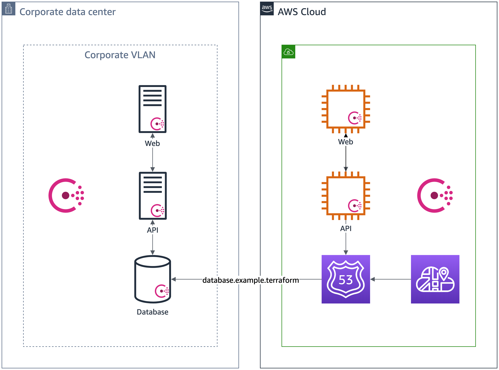
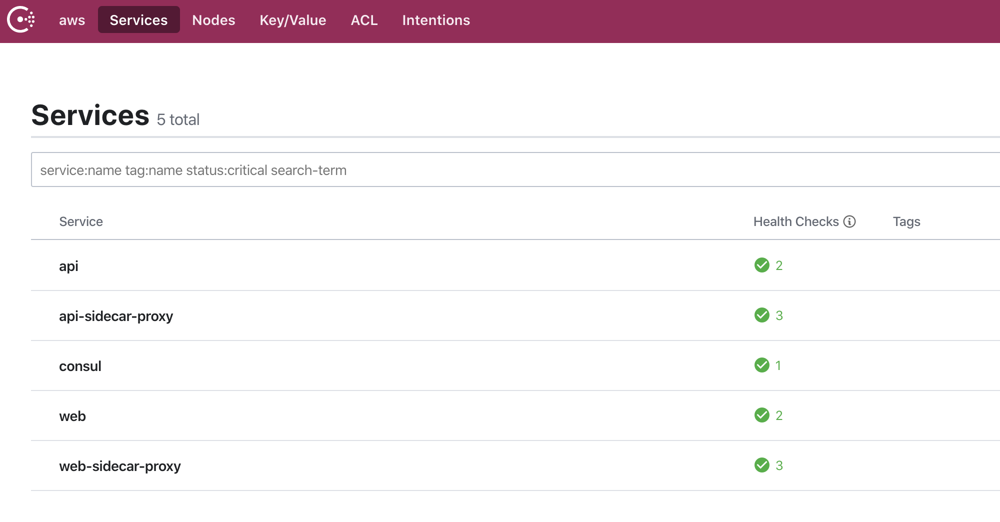
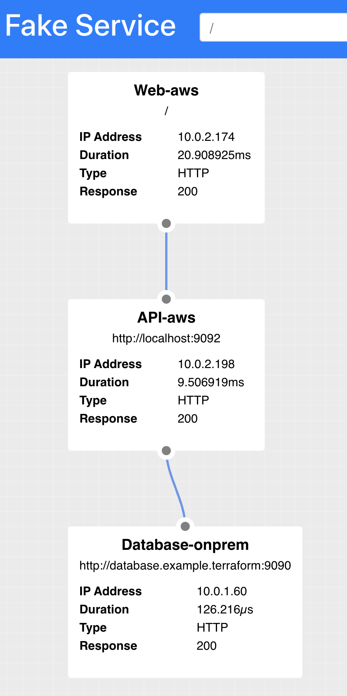
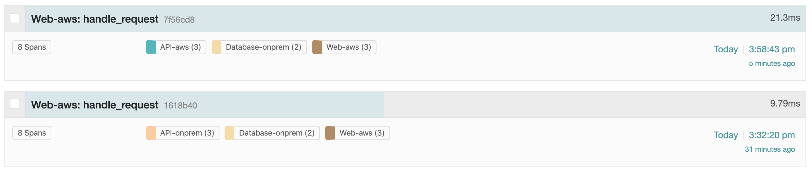
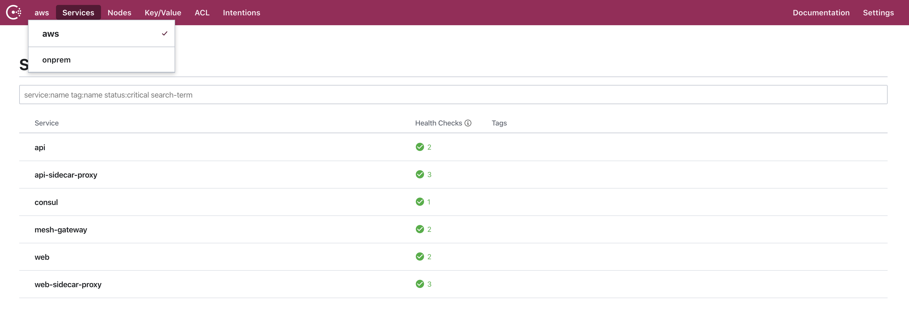

# Stretch the Mesh from OnPrem to AWS

We start refactoring the API and deploy it to AWS. However, while we know the Web UI on AWS works,
we need to figure out if the API on AWS works correctly. We stretch the mesh by creating a Consul
server on AWS and installing a Consul agent on the Web and API EC2 instances.



In order to maintain the connection to the onprem database, we use AWS Cloud Map to
resolve to `database.example.terraform` from the API service on AWS. For additional visibility between
onprem and AWS, we need to stretch our mesh by federating the datacenters.

## Update API Service on AWS

Since we use AWS Cloud Map's namespace to resolve to our onprem database, we can remove the
`upstream` out of the Consul configuration for the API service.

```json
{
  "service": {
    "name": "api",
    "id":"api",
    "port": 9090,
    "checks": [
      {
       "id": "api",
       "name": "HTTP API on port 9090",
       "http": "http://localhost:9090/health",
       "tls_skip_verify": false,
       "method": "GET",
       "interval": "10s",
       "timeout": "1s"
      }
    ],
    "connect": { 
      "sidecar_service": {
        "port": 20000,
        "proxy": {
          "upstreams": []
        }
      }
    }  
  }
}
```

We update the environment variable for our database URI to use `database.example.terraform`.

```shell
UPSTREAM_URIS=http://database.example.terraform:9090
```

## Direct Web on AWS to API on AWS

We need to reconfigure the web tier to use Consul proxy and direct to API on AWS.

```json
{
  "service": {
    "name": "web",
    "id":"web",
    "port": 9090,
    "checks": [
      {
       "id": "web",
       "name": "Web on port 9090",
       "http": "http://localhost:9090/health",
       "tls_skip_verify": false,
       "method": "GET",
       "interval": "10s",
       "timeout": "1s"
      }
    ],
    "connect": { 
      "sidecar_service": {
        "port": 20000,
        "proxy": {
          "upstreams": [
            {
              "destination_name": "api",
              "local_bind_address": "127.0.0.1",
              "local_bind_port": 9092
            }
          ]
      }
    }  
  }
}
```

The API URI it needs to use would be to the proxy.

```shell
UPSTREAM_URIS=http://localhost:9092
```

In Consul, we see that Web on AWS and API on AWS and their sidecars have registered.



## Check that API on AWS Works

As a result, our Web UI shows that we are connecting to the API on AWS via Consul proxy
and our onprem database at `database.example.terraform`, registered with AWS Cloud Map.



When we examing the traces, we can see that our spans reflect the different datacenters we are sending the requests through!



## Stretch the Mesh between OnPrem and AWS

Let's stretch the mesh by federating between datacenters with Consul. Consul configuration
uses WAN gossip to communicate between "datacenters", an entity representating its own
network. We can set it up over a VPN or public internet. We add the following three lines
to the Consul server configuration.

```hcl
primary_datacenter = "onprem"
advertise_addr_wan = "${dc_public_ip}"
retry_join_wan = ["${other_dc_public_ip}"]
```

Notice we add the public IP address of our Consul server and the public IP address
of the other Consul server in the other datacenter. When we restart Consul,
we can tell the federation works when the Consul UI dropdown indicates both "onprem"
and "aws" datacenters.



Next, we will examine how to manage traffic between onprem and AWS.