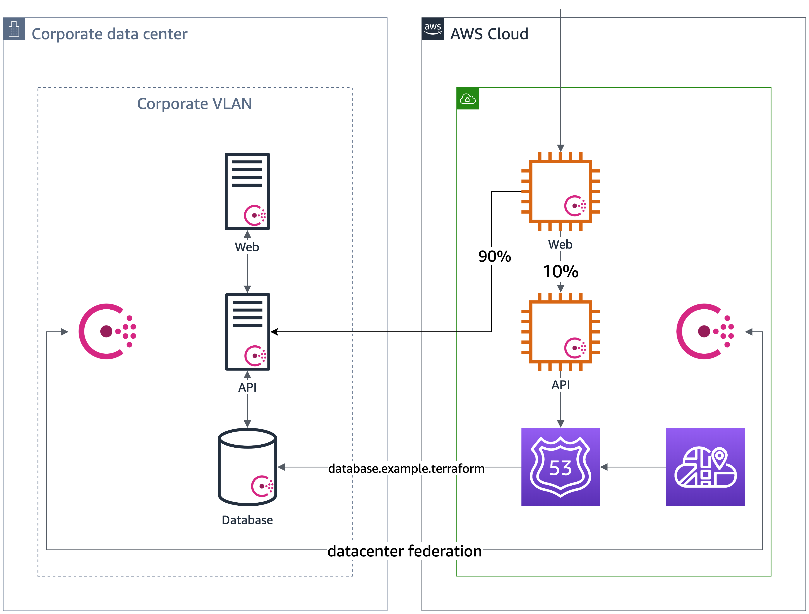

# Gradually Cutover to API on AWS

We test the Web UI on AWS and it works succesfully. We need to test the API on AWS
but we want to ensure it works with live traffic. In order to test API on AWS in production,
we want to _canary_ 10% of traffic to the API on AWS and 90% back to the legacy API onprem.

In order to use a service mesh to do this, we need to federate the datacenters with Consul.

## Federate Consul datacenter
